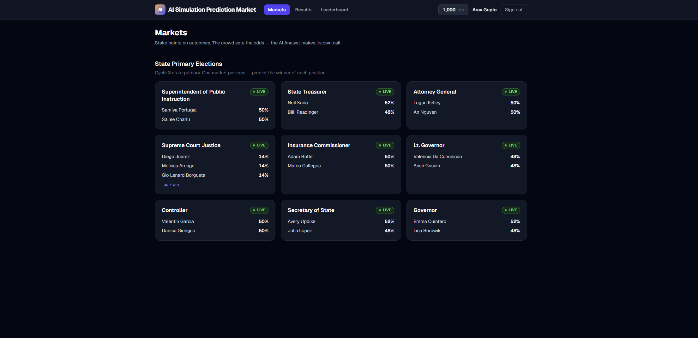
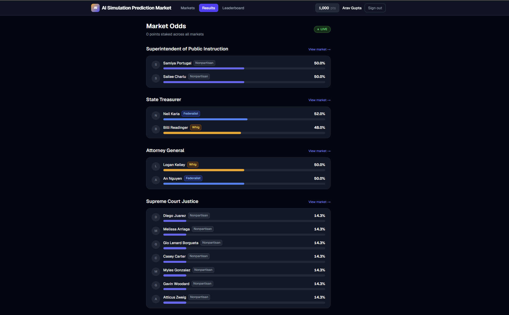
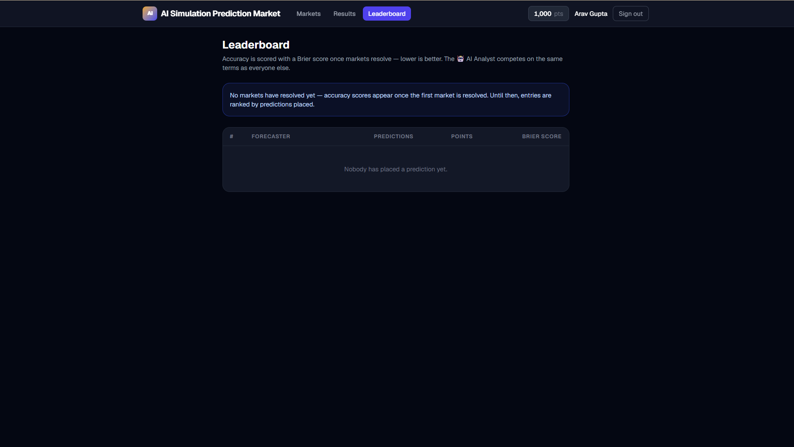
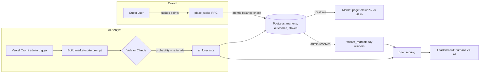

# AI Simulation Prediction Market

Built solo in one week as part of an AI-systems program focused on capitalizing on
uncertainty — AI Simulation Prediction Market is a simulated, points-based prediction
market (in the spirit of Kalshi/Polymarket) where the crowd sets the odds and an
**LLM-powered AI Analyst forecasts independently, then gets scored against them.**

Live at every stage: stake points, watch the crowd odds move in real time, and see
whether the AI Analyst agrees with the room or calls it differently.

> **Demo data has been reset.** Test accounts, stakes, and forecasts created during
> development were wiped before this repo went public — see [`supabase/migrations/0008_reset_demo_data.sql`](supabase/migrations/0008_reset_demo_data.sql).
> The nine "State Primary" markets are seeded with fictional candidates and a neutral
> prior; every number you see live was generated by real usage, not planted data.

Built with Next.js 16 (App Router), Supabase (Postgres + RLS + Realtime), Tailwind CSS v4,
Recharts, and a swappable LLM provider (Vultr Serverless Inference or the Anthropic API).

## Screenshots

<!--
  Drop PNGs into docs/screenshots/ with these exact filenames and they'll render
  below automatically — no markdown edits needed. Suggested shots:
    - markets.png        → the /markets grid (crowd odds visible on a few cards)
    - market-detail.png  → /markets/[slug] with the AI rationale panel expanded
    - leaderboard.png    → /leaderboard showing the AI Analyst row
-->

| Markets | Market detail (crowd vs. AI) | Leaderboard |
|---|---|---|
|  |  |  |

## Architecture



Every stake goes through one atomic RPC so concurrent bets can never overdraw a
balance; every AI forecast goes through the same validation/renormalization step
regardless of which LLM provider produced it; and both humans and the AI Analyst are
scored by the same Brier-score formula once a market resolves — the leaderboard is a
level playing field, not two separate systems bolted together.

## How it works

- **Markets** — admins create markets of three kinds: binary (Yes/No), single-winner
  (many outcomes, one wins), and multi-winner (top-N win, e.g. a 7-seat judicial race).
  Markets can be grouped (e.g. "State Primary Elections").
- **Staking** — every user starts with 1,000 points. Stakes are placed through an atomic
  Postgres RPC (`place_stake`) that check-and-deducts the balance in a single `UPDATE`,
  so concurrent stakes can never overspend (there's a regression test for exactly that).
- **Crowd odds** — outcome probability is a Bayesian blend: an admin-set prior acts as
  100 virtual points and stake volume takes over as the market grows, nudged ±6% by
  community poll votes.
- **🤖 AI Analyst** — a Vercel Cron job (and an admin "re-forecast now" button) sends each
  active market's state (stake distribution, poll tallies, description) to an LLM, which
  returns a validated probability + rationale per outcome. Two interchangeable providers:
  **Vultr Serverless Inference** (OpenAI-compatible, JSON-mode prompting — preferred when
  `VULTR_API_KEY` is set) or **Anthropic Claude** (strict forced tool-use — Haiku 4.5 on
  the cron, Sonnet 5 for deep analyses). The AI's line is drawn beside the crowd's on
  every market, with its rationale one click away.
- **Resolution & payouts** — resolving a market stamps winners and pays winning stakes at
  `min(100 / probability_at_stake, 6)×`. Voiding refunds everyone.
- **Leaderboard** — once markets resolve, every forecaster is scored with a
  [Brier score](https://en.wikipedia.org/wiki/Brier_score) — including the AI Analyst,
  which appears as a competing row. Did the crowd beat the AI?

## Running locally

```bash
npm install
cp .env.example .env.local   # fill in the values (see below)
npm run dev
```

| Variable | Purpose |
|---|---|
| `NEXT_PUBLIC_SUPABASE_URL` / `NEXT_PUBLIC_SUPABASE_ANON_KEY` | Supabase project connection |
| `SUPABASE_SERVICE_ROLE_KEY` | Server-only: admin actions, guest signup, AI forecast writes |
| `ADMIN_PASSWORD` | Gates `/admin` |
| `VULTR_API_KEY` (+ optional `VULTR_BASE_URL`, `VULTR_LLM_MODEL`) | Enables the AI Analyst via Vultr Serverless Inference (preferred when set) |
| `ANTHROPIC_API_KEY` | Enables the AI Analyst via Claude (fallback provider) |
| `CRON_SECRET` | Protects the scheduled forecast endpoint |

### Database

Schema lives in [`supabase/migrations/`](supabase/migrations/) — apply them in order on a
fresh Supabase project (`0001` is the legacy baseline; `0002`–`0007` add the multi-market
model, backfill, RPCs, and RLS lockdowns; `0008` is the pre-publish data reset).
`supabase/schema.sql` is the frozen pre-migration reference and should not be edited or
re-run.

### Tests

```bash
# Proves place_stake cannot overspend under 20 concurrent calls
node scripts/test-stake-concurrency.mjs   # needs SUPABASE_URL, SUPABASE_ANON_KEY, TEST_OUTCOME_ID

# Sanity-checks AI Analyst output quality against fake markets (no DB writes)
node scripts/spike-ai-analyst.mjs         # needs VULTR_API_KEY or ANTHROPIC_API_KEY
```

## Routes

| Route | What it is |
|---|---|
| `/markets` | All markets, grouped, with live crowd + AI odds |
| `/markets/[slug]` | Market detail: staking, AI rationale, forecast-history chart |
| `/results` | Cross-market odds board |
| `/leaderboard` | Brier-scored accuracy ranking — humans vs. the AI Analyst |
| `/onboard` | One-time community poll voting for new users |
| `/admin` | Market console: create/resolve/void markets, outcomes, AI triggers |

## Notes

- Auth is intentionally frictionless: entering a display name creates a disposable guest
  account (no email). Sessions persist per browser.
- This is a simulator — no real money, no real Kalshi API.
